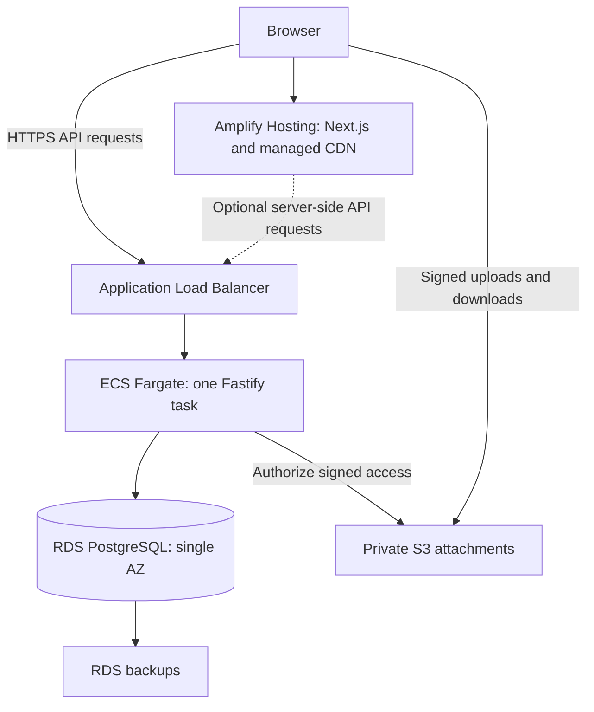
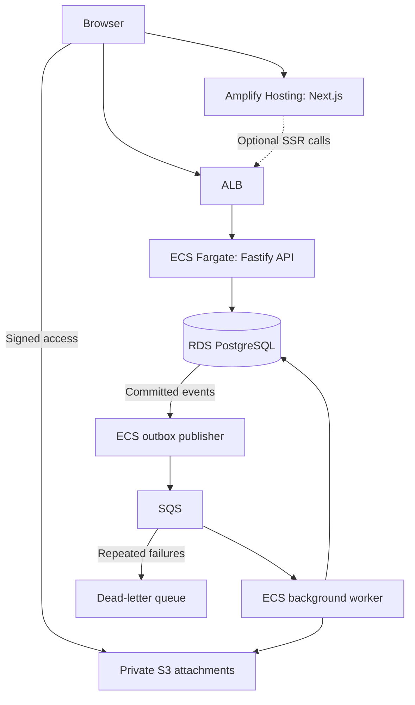
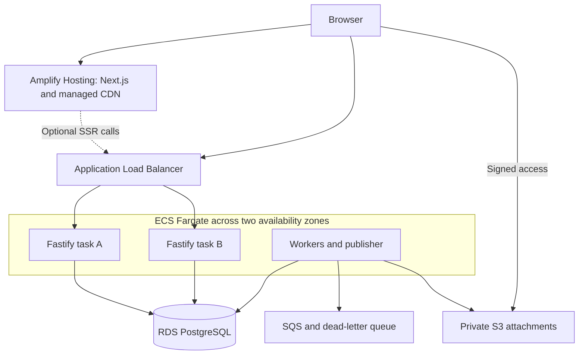
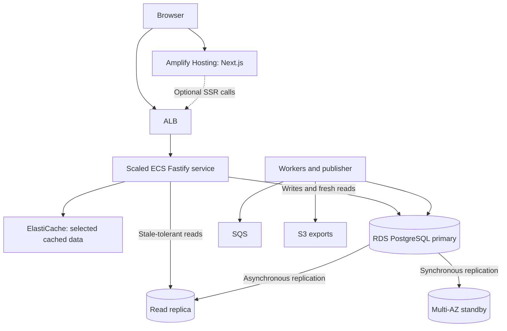
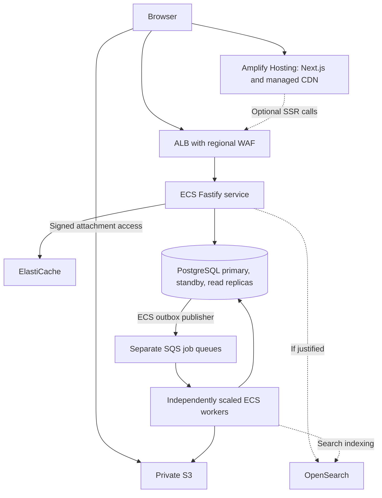

# SupportDesk — System Design Learning Plan

**Stack:** Next.js on Amplify Hosting, Fastify on ECS Fargate, TypeScript, RDS PostgreSQL, AWS
**Scale:** 100 → 1,000 → 10,000 → 100,000 → 1,000,000 daily active users
**Estimated effort:** 16–20 weeks at 8–10 hours per week
**Prepared:** September 29, 2026
**Revision:** 6 — local end-to-end verification recorded

> Build one useful application, measure its limits, and evolve its architecture. User counts below are learning milestones, not automatic infrastructure requirements. All capacity targets are assumptions to validate, not proven production capacity.

## 1. Project objective

Build a multi-tenant support platform where organizations manage customer tickets, agent assignments, comments, attachments, and notifications. Learn system design through implementation, load testing, and controlled failure experiments.

By the end, you should be able to explain why each component exists, identify the current bottleneck, estimate workload and cost, and demonstrate how the system behaves during failures.

### Product scope

| Capability | Initial behavior | System design lesson |
|---|---|---|
| Organizations and memberships | Users belong to organizations with requester, agent, or admin roles | Tenant isolation and authorization |
| Tickets | Create, assign, prioritize, update, and close | Transactions and concurrent updates |
| Comments | Public replies and internal agent notes | Permission boundaries |
| Attachments | Private uploads and authorized downloads | Object storage and metadata consistency |
| Search and filtering | Status, assignee, priority, text, and pagination | Indexing and query performance |
| Activity history | Record important ticket changes | Auditability and data growth |
| Notifications | Background delivery after stage 1 | Queues, retries, and idempotency |
| Exports and dashboards | Add after the core workflow works | Batch processing and aggregation |

Defer live chat, AI-generated replies, billing, inbound email parsing, and complex workflow builders. These can become later projects after the scaling exercises are complete.

## 2. Design principles

1. **Start with a modular monolith.** One Fastify application contains modules for organizations, tickets, comments, attachments, and notifications. Multiple copies of this application can scale horizontally.
2. **Keep business rules in Fastify.** Next.js handles presentation and calls the API; it does not independently modify the database.
3. **Keep PostgreSQL authoritative.** Caches and search indexes contain derived data that can be rebuilt.
4. **Use measurements to justify changes.** Tune a slow query before adding a cache or replica.
5. **Separate availability from capacity.** Even a small application may need redundant infrastructure if downtime is unacceptable.
6. **Make infrastructure reproducible.** Use one infrastructure-as-code approach, such as AWS CDK with TypeScript, and maintain it alongside the application.
7. **Test failure behavior.** A successful load test alone does not prove that the system is reliable.

### Hosting decision and stage progression

Use **Amplify Hosting for Next.js** and **ECS Fargate for Fastify** at every stage. Amplify supplies frontend build/deployment and CDN delivery; ECS runs the API containers. Use Amplify Hosting only: this architecture does not require an Amplify-generated backend, AppSync, or DynamoDB.

This changes the original minimal-server baseline. Include an ALB and RDS from stage 1 to provide a stable HTTPS API endpoint and persistence independent of replaceable containers. The ALB is a chosen ingress design, not a requirement imposed by 100 users or by ECS itself. A single API task still has restart downtime. Managed hosting reduces server administration, but raises the minimum AWS cost compared with the original single-EC2 design.

| Stage | Frontend | API compute | Main addition |
|---|---|---|---|
| 100 DAU | Amplify Hosting | One Fargate task behind ALB | Single-AZ RDS and private S3 |
| 1,000 DAU | Amplify Hosting | One task unless measurements justify more | SQS, outbox, separate ECS workers |
| 10,000 DAU | Amplify Hosting | Two or more tasks across availability zones | Autoscaling and deployment resilience |
| 100,000 DAU | Amplify Hosting | Measured task count | Selected caching, replicas, database failover |
| 1 million DAU | Amplify Hosting | Independently scaled API and workers | Workload isolation, capacity and quota planning |

### Frontend-to-backend contract

- Use `app.example.com` for Amplify and `api.example.com` for the ALB. The browser calls the public HTTPS API; Amplify server-side rendering, if used, calls that endpoint too.
- Configure TLS, an explicit CORS origin allowlist, allowed methods/headers, and credential behavior. CORS is not authentication.
- For the initial dashboard, fetch authenticated ticket data in the browser. With cookie sessions, use Secure/HttpOnly cookies, credentialed requests, and CSRF protection. Do not assume that an API-host-only cookie is available to Amplify SSR.
- For the browser on `app.example.com`, do not read a host-only cookie set by `api.example.com` with `document.cookie`. Return a CSRF token in the authenticated login/session response, send it as a request header on mutations, and keep the matching cookie HttpOnly on the API host.
- If authenticated SSR is added, design deliberate session/token forwarding and verify logout and expiration end to end. Do not assume Amplify compute can reach private ECS service-discovery addresses.
- Keep API/database secrets out of browser bundles and `NEXT_PUBLIC_*` variables. A public API base URL is configuration, not a secret.
- Point preview deployments at an isolated staging API. Do not allow arbitrary preview origins to access production credentials.
- Verify the chosen Next.js version and features against Amplify's current support matrix. At this revision, AWS documentation lists managed support through Next.js 15 and limitations including streaming and on-demand ISR. Run a small deployment compatibility check before committing to framework features.

### Suggested repository layout

| Path | Responsibility |
|---|---|
| `apps/web` | Next.js interface |
| `apps/api` | Fastify routes, authorization, business modules |
| `apps/worker` | Background consumers and outbox publisher, introduced in stage 2 |
| `packages/contracts` | Shared request/response schemas and types |
| `packages/database` | Database migrations and server-side database utilities |
| `infra` | Infrastructure definitions and environment configuration |
| `load-tests` | Repeatable traffic scenarios and dataset generators |
| `docs/decisions` | Architecture decision records and benchmark reports |

Use pnpm workspaces. Select compatible supported framework versions at implementation time, lock dependencies, and keep the API contract stable across deployments.

## 3. Capacity model

Initial assumptions:

- Each daily active user generates 60 API requests per day.
- Peak traffic is 10 times the daily average.
- Approximately 80% of API requests are reads and 20% are writes.
- Attachment bytes transfer directly between the browser and S3.
- The application starts in one AWS region.

**Peak requests/second = daily active users × 60 ÷ 86,400 × 10**

| Stage | Daily active users | API requests/day | Approximate peak RPS |
|---|---:|---:|---:|
| 1 | 100 | 6,000 | 0.7 |
| 2 | 1,000 | 60,000 | 7 |
| 3 | 10,000 | 600,000 | 70 |
| 4 | 100,000 | 6,000,000 | 700 |
| 5 | 1,000,000 | 60,000,000 | 7,000 |

These figures exclude static assets and attachment bytes. Repeated polling, agent-heavy usage, expensive search, and reporting can substantially change the workload. Model active agents and occasional requesters separately once usage patterns become clearer.

Track storage independently: tickets created/day, comments/ticket, average attachment size, attachment frequency, and retention period. For example, 10,000 attachments/day at 2 MB each adds roughly 20 GB/day before deletion or lifecycle policies. This is an illustrative assumption, not a user-count forecast.

## 4. Initial data model

| Entity | Important fields and constraints |
|---|---|
| Organization | ID, name, creation time |
| User | ID, identity reference, profile |
| Membership | Organization ID, user ID, role; unique organization/user pair |
| Ticket | Organization ID, requester, assignee, title, description, status, priority, version, timestamps |
| Comment | Organization ID, ticket ID, author, visibility, body, creation time |
| Attachment | Organization ID, ticket/comment reference, S3 object key, size, upload state |
| Audit event | Organization ID, actor, action, entity reference, timestamp |
| Outbox event | Introduced in stage 2: event ID, payload, state, attempt metadata |
| Job execution | Introduced in stage 2: stable job ID, state, result location |

Apply authorization on every operation. Organization IDs supplied by the client do not prove membership. Use constraints and application checks to prevent references across organizations. Requesters must never receive internal notes through detail, search, export, or attachment endpoints.

Start with indexes matching actual filters, such as `(organization_id, status, created_at, id)`, and use a stable cursor containing a timestamp and unique ID. Avoid adding every possible index: indexes also increase write and maintenance cost.

## 5. Stage 1 — 100 daily active users

**Goal:** Deliver the core workflow with independently deployed frontend and API, while keeping backend capacity minimal.

### Implementation

- [ ] Run Next.js, Fastify, and PostgreSQL locally; Docker Compose is for local development.
- [ ] Connect the repository to Amplify Hosting and configure the pnpm monorepo build for `apps/web`.
- [ ] Verify the chosen Next.js version, routing, and rendering features on Amplify.
- [ ] Build the Fastify image, push it to ECR, and deploy one ECS Fargate API task.
- [ ] Configure an ALB HTTPS listener, certificate, IP target group, and health checks.
- [ ] Provision single-AZ RDS PostgreSQL with bounded API connection pooling.
- [ ] Implement the domain, CORS, and session contract described in section 2.
- [ ] Implement login, organization membership, roles, tickets, assignments, comments, internal notes, and activity history.
- [ ] Add bounded pagination, input validation, and private signed attachment access.
- [ ] Add structured logs, request IDs, health checks, and CloudWatch monitoring.
- [ ] Enable RDS backups and rehearse restoration to a separate instance.
- [ ] Define independent frontend and API release/rollback workflows.

For attachments, authorize first, allocate an object key, upload directly to S3, then verify the object before marking it available. Enforce size limits, distinguish unfinished uploads, and clean up orphaned objects. Treat uploaded content as untrusted.

Use ECS task roles for application AWS access and a separate task execution role for container startup needs. Keep credentials outside source control and images. Never persist PostgreSQL or permanent uploads inside an API task.

For the learning baseline, place the public ALB across two public subnets. An API task can use a public subnet and public IP for outbound access while its security group allows inbound application traffic only from the ALB security group. Keep RDS in private database subnets with access only from authorized task security groups. Later move tasks to private subnets with explicitly budgeted NAT or VPC endpoints. A public task IP is not the application endpoint.

### Deliberately deferred

Multiple API tasks, autoscaling, SQS, Redis, database replicas, Multi-AZ database failover, and microservices. Amplify's CDN and the API ALB already exist by design; no separate frontend CloudFront distribution is needed.

### Acceptance criteria

- [ ] Frontend and API deploy and roll back independently.
- [ ] Browser login, API calls, preflight requests, and logout work across the selected domains.
- [ ] Two organizations cannot access each other's data; requesters cannot access internal notes.
- [ ] Core workflows meet section 10 targets.
- [ ] Replacing the API task does not lose database or attachment data.
- [ ] A database backup restores successfully; recovery time and data loss are recorded.

**Failure exercise:** Stop the single API task and measure replacement downtime. Restore RDS to a separate instance and verify data using an isolated application configuration.

**Trigger for the next stage:** Exports or notifications delay requests or need durable retries. Frontend/API hosting remains unchanged.

## 6. Stage 2 — 1,000 daily active users

**Goal:** Add durable background processing while retaining Amplify and the existing ECS API.

### Implementation

- [ ] Keep the existing RDS database and rehearse backward-compatible schema migrations.
- [ ] Configure bounded connection pools and database monitoring.
- [ ] Add SQS and separate ECS worker/publisher services for exports and notifications.
- [ ] Implement an outbox table and publisher.
- [ ] Add retry limits, visibility timeout handling, and a dead-letter queue.
- [ ] Add PostgreSQL full-text search if simple filters are no longer enough.

Write the ticket change and its outbox event in the same database transaction. The publisher sends committed events to SQS and records delivery progress. A crash can cause republishing, so consumers must tolerate duplicate messages. Use stable event/job IDs and deduplication constraints. External notifications need their own duplicate-handling strategy; do not claim exactly-once delivery merely because a job is marked complete.

A single-AZ RDS instance is acceptable for the learning baseline if downtime is acceptable. Multi-AZ is an availability choice and can be introduced earlier if required.

### Acceptance criteria

- [ ] Ticket creation does not wait for notification delivery or export generation.
- [ ] A committed ticket event survives a publisher outage.
- [ ] Reprocessing an export job produces one logical result.
- [ ] Repeatedly failing jobs become inspectable in the dead-letter queue.
- [ ] RDS backup restoration is rehearsed.

**Failure exercise:** Kill a worker after it performs work but before acknowledging its message. Restart it and verify duplicate handling. Pause the publisher and verify it catches up.

**Trigger for the next stage:** Single-task restarts interrupt users, the API lacks headroom, or worker throughput needs independent scaling. Seven peak RPS alone does not require additional API tasks; the ALB already provides stable ingress.

## 7. Stage 3 — 10,000 daily active users

**Goal:** Scale the backend horizontally and improve availability while Amplify continues to host the frontend.

### Implementation

- [ ] Increase the API service to at least two tasks spread across availability zones.
- [ ] Configure health checks, connection draining, and graceful shutdown.
- [ ] Use shared sessions or correctly validated tokens; avoid per-process session state.
- [ ] Add API autoscaling with minimum/maximum task counts and measured signals.
- [ ] Scale workers using backlog and oldest-message age, not CPU alone.
- [ ] Use rolling API deployments and backward-compatible database migrations.
- [ ] Keep Amplify releases independent while maintaining API compatibility.
- [ ] Measure frontend build, delivery, and SSR behavior separately from API throughput.
- [ ] Move tasks to private subnets if selected, with working egress for image pulls, logs, AWS APIs, and external dependencies.

Amplify handles frontend hosting and CDN delivery. Do not add ECS Next.js containers or a second frontend CDN in this stage. Keep authenticated ticket responses uncached in shared delivery layers and validate rendering/cache behavior against Amplify's supported features.

The RDS instance remains a separate availability consideration: multiple API tasks do not make a single-AZ database highly available. Introduce Multi-AZ earlier than stage 4 if the service objective requires it.

### Acceptance criteria

- [ ] Sessions remain correct when consecutive requests reach different API tasks.
- [ ] A rolling API release completes while traffic continues.
- [ ] Terminating one API task does not cause a prolonged outage.
- [ ] Autoscaling adds capacity within a measured time and respects maximum limits.
- [ ] Old and new API/frontend releases can coexist during deployment.
- [ ] Amplify errors and latency can be distinguished from ALB/API errors and latency.

**Failure exercise:** Terminate an API task during peak traffic and deploy a deliberately unhealthy backend version. Separately test a frontend rollback.

**Trigger for the next stage:** Query latency, database pressure, repeated reads, or recovery objectives justify additional data-layer components.

## 8. Stage 4 — 100,000 daily active users

**Goal:** Optimize database access and improve availability without losing consistency.

The existing Amplify frontend, ALB, ECS API, attachment, and queue paths remain. This diagram focuses on changes to the data layer.

### Implementation order

| Order | Change | Evidence required |
|---|---|---|
| 1 | Tune queries, indexes, and pagination | Slow query plans or excessive scanned rows |
| 2 | Precompute expensive dashboard aggregates | Repeated aggregation dominates database work |
| 3 | Add selected cache entries | Repeated reads tolerate bounded staleness |
| 4 | Add a read replica | Read pressure persists after tuning |
| 5 | Add Multi-AZ database failover | Recovery requirements justify it; may happen earlier |

Read replicas and standby replicas are different. RDS read replicas use asynchronous replication and may lag. A traditional Multi-AZ DB instance standby provides failover and does not serve application reads. This plan uses that deployment type; Multi-AZ DB clusters have a different topology.

Read a ticket from the primary immediately after updating it. Only route queries that tolerate stale data to the replica. Caches should contain tenant-scoped keys, bounded TTLs, and a documented invalidation policy.

- [ ] Add protection against many requests rebuilding the same expired cache entry.
- [ ] Use ticket versions or conditional updates to prevent silent concurrent overwrites.
- [ ] Apply per-organization limits and shared enforcement where necessary.
- [ ] Calculate the maximum database connections from all API and worker tasks; Amplify does not connect directly to PostgreSQL.
- [ ] Add a connection proxy/pooler only if measured connection pressure warrants it.
- [ ] Trace API, database, and background job latency with correlated identifiers.
- [ ] Exercise database failover and cache-unavailable behavior.

### Acceptance criteria

- [ ] Each optimization has a before/after benchmark and a cost tradeoff.
- [ ] A ticket does not appear to revert immediately after a successful update.
- [ ] Cache failure does not overwhelm the database through unlimited fallback traffic.
- [ ] Concurrent ticket edits produce an explicit conflict rather than a silent lost update.
- [ ] One noisy organization cannot consume all shared capacity.

**Failure exercise:** Disable the cache under load, trigger database failover, and generate traffic skewed toward one organization.

**Trigger for the next stage:** Measured write capacity, large-tenant interference, data growth, or search requirements exceed what the tuned design can support.

## 9. Stage 5 — 1 million daily active users

**Goal:** Demonstrate capacity planning, workload isolation, and recovery at high load.

The grouped database node represents the primary, failover standby, and explicitly routed read replicas. The outbox publisher remains a separate process even though its path is condensed in this diagram. Private attachments remain separate from Amplify's frontend delivery and require authorized signed access. The regional WAF shown here protects the API ALB; it does not imply that the frontend is protected by the same association.

### Implementation

- [ ] Separate notification, export, and indexing queues so bulk work cannot block urgent work.
- [ ] Add bounded retries, timeouts, backpressure, and overload responses.
- [ ] Enforce tenant quotas and fair access to worker capacity.
- [ ] Add retention, archival, and attachment lifecycle policies.
- [ ] Measure capacity for requests, DB I/O, storage, downloads, and queue processing separately.
- [ ] Add OpenSearch only when search features or measured performance justify it.
- [ ] Make derived search indexes rebuildable and handle out-of-order updates using entity versions.
- [ ] Define recovery-time and recovery-point objectives, then demonstrate them.
- [ ] Attach API protection to the ALB and restrict task ingress to the ALB security group.
- [ ] Validate Amplify request/compute quotas, SSR latency, build limits, and delivery costs against the target frontend workload; arrange quota increases where available before testing.

### Conditional extensions

| Extension | Introduce only when |
|---|---|
| Table partitioning | Data maintenance or query patterns benefit from partition boundaries |
| Tenant-based sharding | A tuned single primary cannot meet measured write/storage requirements |
| Dedicated service extraction | Ownership, release independence, or scaling provides a concrete benefit |
| Multi-region architecture | Latency, residency, or disaster recovery requires it |
| Dedicated real-time subsystem | A future live-update feature creates a measured connection workload |

One million daily users does not automatically require sharding, Kubernetes, Kafka, or microservices. Validate the modeled 7,000 peak RPS against realistic requests and datasets before claiming that the architecture supports it.

### Acceptance criteria

- [ ] A sustained test demonstrates the target workload on a recorded infrastructure configuration.
- [ ] The load generator itself has sufficient capacity and reports no hidden dropped work.
- [ ] A traffic spike does not cause unbounded retry amplification or connection growth.
- [ ] Core ticket operations remain prioritized when bulk processing is delayed.
- [ ] Queues drain after recovery without overwhelming downstream systems.
- [ ] A recovery report documents observed results, limitations, and remaining risks.

**Failure exercise:** Combine a traffic spike with an unavailable dependency. Measure user-facing errors, queue growth, and recovery time.

## 10. Verification strategy

### Initial service targets

| Metric | Initial learning target |
|---|---|
| Ticket read API latency | p95 below 300 ms |
| Ticket write API latency | p95 below 500 ms |
| Unexpected server errors | Below 0.5% during the defined steady workload |
| Notification queue age | Normally below 60 seconds |
| Tenant isolation | No cross-organization access |
| Recovery | Measured restoration time and data loss at every relevant stage |

These are project goals, not guarantees. Measure from a documented generator location and distinguish API latency from browser page experience. Track rejected/rate-limited requests separately so they cannot make a saturated system appear healthy.

### Repeatable load-test workflow

Use k6 or an equivalent load-testing tool. Keep scenario definitions in the repository.

1. Seed a realistic dataset with historical tickets, comments, attachments, and uneven organization sizes.
2. Run a low-load baseline to establish functional correctness and normal latency.
3. Run typical traffic, then sustain the stage's modeled peak for at least 30 minutes.
4. Run a short spike and an appropriately scoped longer soak test.
5. Introduce one controlled failure and record recovery behavior.
6. Change one architectural variable and repeat the same workload.

Suggested API mix: 45% ticket lists, 25% ticket details, 10% search, 10% comments, 5% ticket creation, and 5% status/assignment updates. Test upload authorization and S3 transfer throughput as an additional scenario. Authentication setup, polling, and SSR API calls must be counted when translating this model into generated traffic.

Use an arrival-rate workload when validating target RPS. Include think time when modeling user sessions, and report both request rate and concurrent users rather than treating them as interchangeable.

### Evidence to retain

- Infrastructure configuration and application commit.
- Dataset size, traffic mix, test duration, and generator placement.
- Achieved throughput, latency percentiles, errors, and rejected requests.
- CPU, memory, database I/O, slow queries, connections, cache hit rate, and queue age.
- Failure timeline and time to recovery.
- Approximate experiment cost and the next identified bottleneck.

## 11. Delivery roadmap

| Period | Deliverable | Exit milestone |
|---|---|---|
| Weeks 1–4 | MVP on Amplify, ECS, ALB, and RDS | Core workflow works and backup restoration succeeds |
| Weeks 5–7 | SQS, outbox, and ECS workers | Background work survives process failures |
| Weeks 8–11 | Multiple API tasks, autoscaling, and deployment resilience | Rolling release and task-loss exercise pass |
| Weeks 12–15 | Query tuning, cache, replicas, and failover | Measured performance gains and correct consistency behavior |
| Weeks 16–20 | Large datasets, isolation, overload, recovery | Capacity report with evidence and limitations |

Keep advanced infrastructure temporary while learning. Completing a well-measured stage is more valuable than provisioning every box without understanding it.

## 12. Cost and operational boundaries

The monthly budget has not yet been specified. Before provisioning, choose a region, set a budget, estimate the planned resources using current AWS pricing, and set maximum task counts.

- Keep the smallest useful environment running; recreate advanced stages for experiments.
- Tag resources by project, environment, and stage.
- Track Amplify builds, delivery and SSR compute, Fargate task uptime, database instances, ALB, NAT gateways, interface endpoints, cache/search clusters, log retention, data transfer, and backups.
- Budget alerts notify; do not treat them as a hard spending cap.
- Set explicit log retention and safe object lifecycle policies.
- Tear down experimental resources after preserving needed data and benchmark evidence.
- Use synthetic support data for load tests.

Do not assume that a smaller successful test proves million-user capacity. When cost prevents a full test, report what was tested, what is extrapolated, and which assumptions remain unverified.

## 13. Architecture decision record template

For every significant change, record:

| Field | Question |
|---|---|
| Problem | What measurable limitation or requirement exists? |
| Evidence | Which metric, trace, failure, or product requirement demonstrates it? |
| Options | What simpler alternatives were considered? |
| Decision | What changes and why? |
| Consequences | What cost, operational work, or consistency tradeoff is introduced? |
| Verification | Which before/after result supports the decision? |
| Rollback | How can the change be reversed safely? |

## 14. First implementation milestone

- [ ] Initialize the pnpm workspace and application skeletons.
- [ ] Run Next.js, Fastify, and PostgreSQL locally.
- [ ] Create two organizations and verify isolated access.
- [ ] Create a ticket, add a public reply and an internal note.
- [ ] Upload and download a private attachment.
- [ ] Deploy Next.js to Amplify and one Fastify task to ECS Fargate behind an ALB.
- [ ] Provision single-AZ RDS and verify domain, TLS, CORS, and session behavior.
- [ ] Capture a baseline load test.
- [ ] Restore a database backup into a fresh environment.

**Definition of done:** A user can complete the core support workflow, tenant boundaries hold, and the application can recover its data from a tested backup.

## 15. Technical references

These official references informed the architecture. Consult the current documentation when implementing specific configurations.

- [Amplify Hosting overview and managed CDN](https://docs.aws.amazon.com/amplify/latest/userguide/welcome.html)
- [Amplify Next.js version and feature support](https://docs.aws.amazon.com/amplify/latest/userguide/ssr-amplify-support.html)
- [Amazon ECS service load balancing](https://docs.aws.amazon.com/AmazonECS/latest/developerguide/service-load-balancing.html)
- [Amazon ECS service autoscaling](https://docs.aws.amazon.com/AmazonECS/latest/developerguide/service-auto-scaling.html)
- [S3 presigned uploads and downloads](https://docs.aws.amazon.com/AmazonS3/latest/userguide/using-presigned-url.html)
- [SQS at-least-once delivery](https://docs.aws.amazon.com/AWSSimpleQueueService/latest/SQSDeveloperGuide/standard-queues-at-least-once-delivery.html)
- [Transactional outbox pattern](https://docs.aws.amazon.com/prescriptive-guidance/latest/cloud-design-patterns/transactional-outbox.html)
- [RDS read replicas](https://docs.aws.amazon.com/AmazonRDS/latest/UserGuide/USER_ReadRepl.html)
- [RDS Multi-AZ DB instance deployments](https://docs.aws.amazon.com/AmazonRDS/latest/UserGuide/Concepts.MultiAZSingleStandby.html)
- [CloudFront private-content signed URLs](https://docs.aws.amazon.com/AmazonCloudFront/latest/DeveloperGuide/private-content-signed-urls.html)

## 16. Implementation log

### September 29, 2026 — Apple-inspired web redesign

**Requirement:** Apply the visual direction in `DESIGN-apple.md` to the existing SupportDesk web application without changing its API contract or core ticket workflow.

**Implemented locally:** Rebuilt the Next.js login, inbox, conversation detail, and new-ticket dialog with the design's restrained palette, SF-style typography, black 44px global navigation, frosted 52px workspace navigation, blue pill actions, light surfaces, and responsive layouts. The inbox retains search, status filters, organization switching, ticket selection, assignment/status updates, replies, internal notes, and attachments. Unimplemented Knowledge and Settings navigation is visibly non-interactive rather than linking nowhere. Main implementation: `apps/web/app/desk.tsx` and `apps/web/app/styles.css`.

**Verification:** The web renders at desktop and 390px mobile widths without horizontal overflow. Browser checks covered login, inbox, conversation detail, new-ticket dialog, and status filtering. `pnpm typecheck` passed across the workspace; `pnpm test` passed its two unit tests (three integration tests were skipped by that command). The local API readiness endpoint returned `ready`. These checks do not establish production deployment, browser-wide compatibility, or performance targets.

**Next:** Continue the stage-1 deployment and recovery acceptance criteria above. Keep this plan's implementation log updated with subsequent material product, architecture, and infrastructure changes, including what was verified and what remains open.

### September 29, 2026 — Complete inbox cursor pagination

**Requirement:** The stage-1 API already limits ticket-list responses and returns a cursor, but the web inbox previously displayed only the first page. Agents and requesters need to reach every ticket in a large result set.

**Implemented locally:** Added a “Load more conversations” control that appends the next cursor page. Status filters, text search, organization switching, and ticket updates retain the correct list query; stale in-flight list responses cannot overwrite a newer selection. The implementation is in `apps/web/app/desk.tsx` and `apps/web/app/styles.css`.

**Verification at implementation:** Added an API integration test that creates three uniquely searchable tickets, fetches them over two cursor pages, and confirms no missing or duplicate IDs. `pnpm test:integration` passed all four tests against local PostgreSQL. `pnpm typecheck` passed across the workspace, and `pnpm test` passed its two unit tests (integration tests are intentionally skipped by that command). Browser verification was completed in the local end-to-end check below.

**Next:** Exercise the control in the browser with a larger seeded dataset, then continue the stage-1 deployment and recovery acceptance criteria. No production deployment or capacity target is claimed by this change.

### September 29, 2026 — Cross-subdomain CSRF contract

**Requirement:** The local app and API share the `localhost` hostname, but the planned deployment uses `app.example.com` and `api.example.com`. Browser JavaScript on the app host cannot read an API-host-only CSRF cookie, so the previous `document.cookie` lookup would break authenticated mutations after deployment.

**Implemented locally:** Login and session-restoration responses now include the CSRF token. The web client stores that response value in memory and sends it in `x-csrf-token` for mutations. The matching CSRF cookie remains scoped to the API and is now HttpOnly; no shared parent-domain cookie is required. A valid restored session gets a replacement CSRF cookie if one is missing. Changed `apps/api/src/app.ts` and `apps/web/app/desk.tsx`.

**Verification at implementation:** Added focused auth-route tests for the login response and session restoration; `pnpm test` passed all four unit tests, and `pnpm typecheck` passed across the workspace. Docker was stopped at that point; the integration suite was rerun successfully in the local end-to-end check below. Browser verification on distinct real subdomains and production deployment remain open.

### September 29, 2026 — Local end-to-end verification

**Environment:** Restarted the repo's PostgreSQL and LocalStack containers and the Next.js/Fastify development servers. No cloud resources were provisioned.

**Results:** `pnpm test:integration` passed all five database-backed tests, `pnpm test` passed four unit tests, and `pnpm typecheck` passed across the workspace. In the browser, a temporary response fixture displayed 25 tickets, then “Load more conversations” appended ticket 26 exactly once and removed the control when no cursor remained. This tested the UI without adding 26 database rows; the integration test separately exercised real API cursor pages. With the real API, login, ticket creation, a public reply, a status update, reload/session restoration, and a second status update all succeeded. The browser console had no errors after the workflow.

**Cleanup:** Removed the single temporary QA ticket created for the mutation check, its one comment, four audit events, and four outbox events from local PostgreSQL; verified zero matching rows remain. The browser-only pagination fixture was also removed. Docker containers and development servers remain running for further local testing.

**Still open:** Cross-subdomain browser verification on actual `app`/`api` hostnames, deployment and rollback, backup restoration, and stage-1 latency/capacity measurements. The local checks do not prove those acceptance criteria.

### September 29, 2026 — Source repository publication

**Decision:** Publish the current workspace branch, `TheKodister/supportdesk-system-design-plan`, to `https://github.com/TheCodister/support-portal.git`. Keep the implementation plan in the repository root alongside the application and infrastructure code.

**Boundary:** Publishing source code does not deploy Amplify, ECS, RDS, or other AWS resources. The AWS deployment prerequisites in the operations guide remain open, including a non-root deployment identity, budget, domains, and TLS certificate.

---

**Diagram viewing:** This Markdown file contains five Mermaid architecture diagrams. Open it in a Markdown viewer with Mermaid support to see rendered diagrams; the diagram source remains editable in any text editor.
